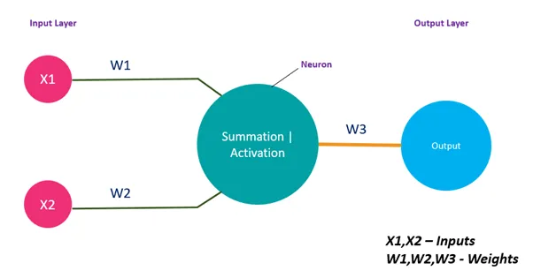
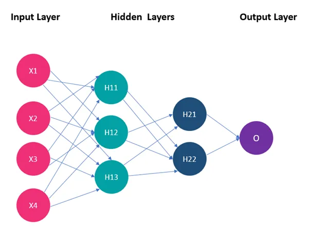
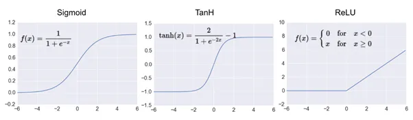
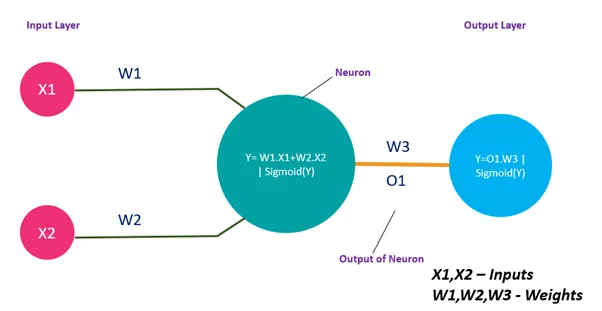
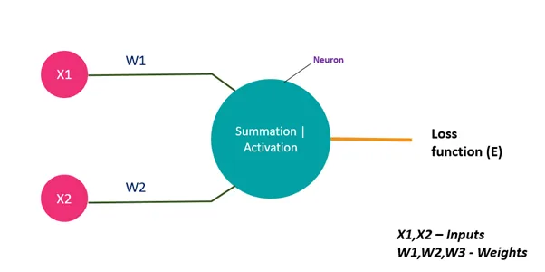
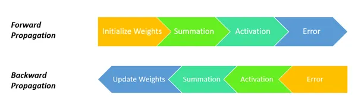

 

# Neural Network from Scratch using Numpy

This repository contains the implementation of a neural network built from scratch using only NumPy. The project demonstrates fundamental concepts of neural networks and is a valuable learning resource for those interested in understanding how neural networks work at a basic level.

# Model Fitting time for 2000 epochs

```
CPU Model fit time 2 min 16 sec
GPU Model fit time 50 sec
```

## 🎯 Features

- Fully connected layers
- Activation functions: ReLU, Sigmoid, Tanh
- Loss functions: Mean Squared Error, Cross-Entropy
- Gradient descent optimization

## 🏗️ How It's Built

- Python 3.12
- cuda 12.2
- numpy
- cupy (Numpy in GPU)

# 🚀 Getting Started

    A simple artificial neuron having an input layer and output layer is called a perceptron.


    What does this Neuron contain?
      1. Summation function
      2. Activation function

    The inputs given to a perceptron are processed by Summation function and followed by activation function to get the desired output.



    This is a simple perceptron, but what if we have many inputs and huge data a single perceptron is not enough right?? We must keep on increasing the neurons. And here is the basic neural network having an input layer, hidden layer, output layer.
  
    
    We should always remember that a neural network has a single input layer, output layer but it can have multiple hidden layers. In the above fig, we can see the sample neural network with one input layer, two hidden layers, and one output layer.
    
    
  ###  Activation Function
    The main purpose of the activation function is to convert the weighted sum of input signals of a neuron into the output signal. And this output signal is served as input to the next layer.
  
  
  ### Sigmoid
    - Ranges from 0 and 1.
    - A small change in x would result in a large change in y.
    - Usually used in the output layer of binary classification.    
  
  ### Tanh
    - Ranges between -1 and 1.
    - Output values are centered around zero.
    - Usually used in hidden layers.
  
  ### RELU (Rectified Linear Unit)
    - Ranges between 0 and max(x).
    - Computationally inexpensive compared to sigmoid and tanh functions.
    - Default function for hidden layers.
    - It can lead to neuron death, which can be compensated by applying the Leaky RELU function.
  
  ## Working of Neural Network
    A neural network works based on two principles
    1. Forward Propagation
    2. Backward Propagation
    
    
    Let’s understand these building blocks with the help of an example. Here I am considering a single input layer, hidden layer, output layer to make the understanding clear.
  ### Forward Propagation
  
  
    1.Considering we have data and would like to apply binary classification to get the desired output. 
    
    2.Take a sample having features as X1, X2, and these features will be operated over a set of processes to predict the outcome.    
    
    3.Each feature is associated with a weight, where X1, X2 as features and W1, W2 as weights. These are served as input to a neuron.
    
    4.A neuron performs both functions. a) Summation b)Activation.
    
    5.In the summation, all features are multiplied by their weights and bias are summed up. (Y=W1X1+W2X2+b).
    
    6.This summed function is applied over an Activation function. The output from this neuron is multiplied with the weight W3 and supplied as input to the output layer.
    
    7.The same process happens in each neuron, but we vary the activation functions in hidden layer neurons, not in the output layer.
    
  ## Backward Propagation
  
  ### 🔗 Chain Rule
      The chain rule provides us a technique for finding the derivative of composite functions, with the number of functions that make up the composition determining how many differentiation steps are necessary. For example, if a composite function f( x) is defined as

$$f(x) =  (g * h ) (x) = g[h(x)] \\
then  f'(x) = g'[h(x)] * h'(x)
$$
  
      
    In neural networks, our main goal will be on reducing the error, to make it possible we have to update all the weights by doing backpropagation. We need to find a change in weights such that error should be minimum. To do so we calculate dE/dW1 and dE/dW2.


$$
considering \ S \ (summation)  = x_1 * w_1 + x_2 * w_2
\\
            \ A \ (activation) = sigmoid = \frac{e^x}{(1+ e^x)}
$$
$$
Using Chain Rule \\
\frac{dE}{dW_1} = \frac{dE}{dA} \times \frac{dA}{dS} \times \frac{dS}{dW_1}
$$
$$
\frac{dE}{dW_2} = \frac{dE}{dA} \times \frac{dA}{dS} \times \frac{dS}{dW_2}
$$


    Once you have calculated changes in weights concerning error our next step will be on updating the weights using gradient descent procedure.

$$
W_1new = w_1old - \eta \frac{dE}{dW_1}
\\
W_2new = w_2old - \eta \frac{dE}{dW_2}
$$


## Installation

### 1. Clone the repository:

```bash
git clone https://github.com/mihirh19/neural_network_from_scratch_only_numpy.git
cd neural_network_from_scratch_only_numpy
```

### 2. Create and activate a virtual environment:

```bash
python -m venv venv
source venv/bin/activate  # On Windows use `venv\Scripts\activate`
```

### 3. Install the required packages:

```bash
   pip install numpy cupy pandas
```

# Usage

You can train and test the neural network using the provided Jupyter notebooks:

- `cpu.ipynb`:Implementation using CPU
- `usinggpu_cuda.ipynb`: Implementation with CUDA for GPU acceleration

# CUDA and CuPy

- `CUDA`: CUDA (Compute Unified Device Architecture) is a parallel computing platform and programming model developed by NVIDIA. It enables developers to leverage the power of NVIDIA GPUs for general purpose processing.
- `CuPy`: CuPy is an open-source array library that leverages NVIDIA CUDA for high-performance operations on GPUs, providing a NumPy-compatible interface for GPU-accelerated computing.

## Author

👤 **Mihir Hadavani**

- Twitter: [@mihirh21](https://twitter.com/mihirh21)
- Github: [@mihirh19](https://github.com/mihirh19)
- LinkedIn: [@mihir-hadavani-996263232](https://linkedin.com/in/mihir-hadavani-996263232)

## Show your support

<a href="https://www.buymeacoffee.com/mihir21"></a>

Give a ⭐️ if this project helped you!
